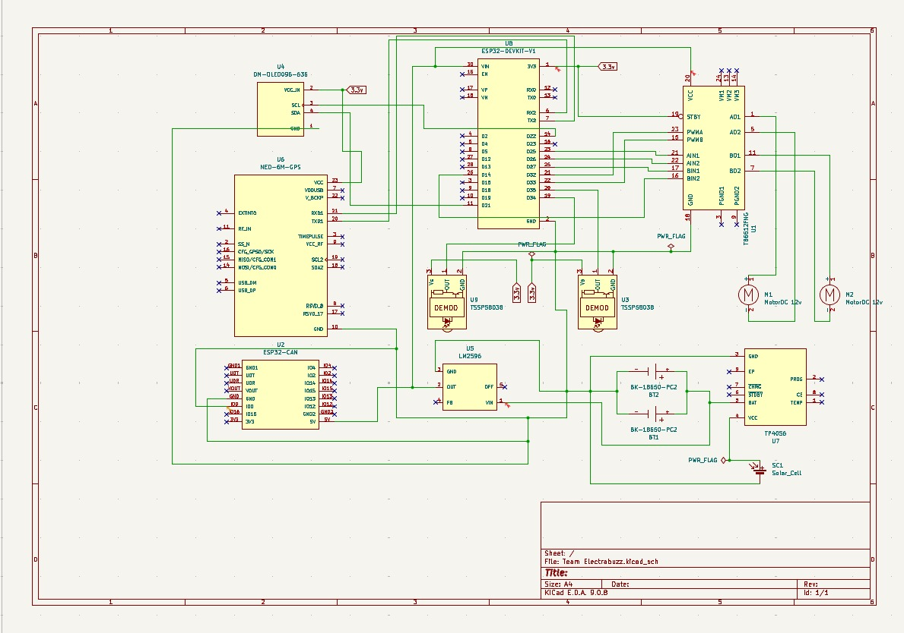
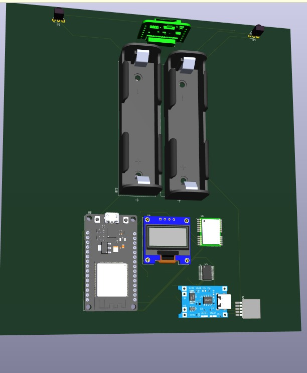
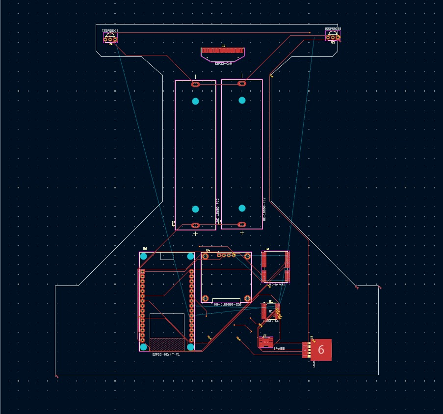
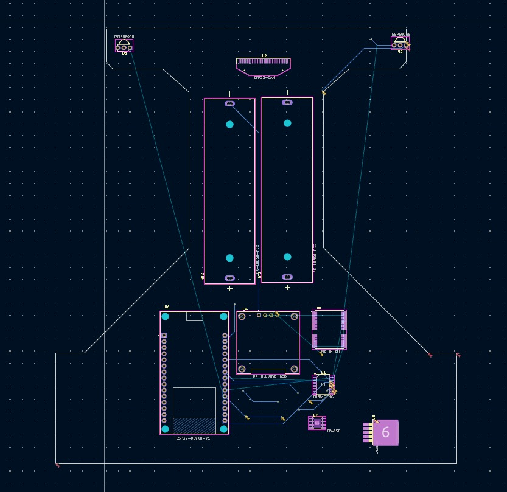
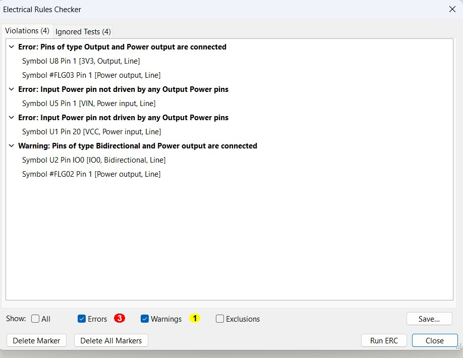
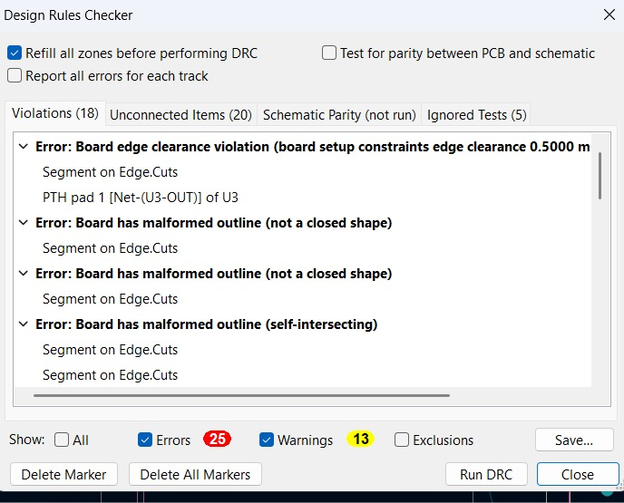

# PCB Design & Manufacturing Specifications

This document provides details on the printed circuit board design, layer allocation, and design rule checks for the **Electabuzz** line-follower car.

---

## 1. PCB Specifications

- **EDA Tool**: KiCad 9.0
- **Layer Count**: 2 Layers (Top Copper: F.Cu, Bottom Copper: B.Cu)
- **Substrate**: Standard FR4 (1.6 mm thickness)
- **Copper Thickness**: 1 oz (35 µm)
- **Minimum Clearance**: 0.50 mm (design constraint rule)

---

## 2. Layout & Routing

### Schematic Overview
The system schematic isolates sensitive digital communication lines from high-current motor drive returns.

### 3D Render
The 3D rendered board layout confirms mechanical clearances for the dual 18650 battery cell holders, ESP32 DevKit module, and front sensor mounts.

### Copper Layer Routing
- **Front Copper (F.Cu)**: Carries primary signal buses (I²C, UART, PWM logic) and module interconnects.
- **Back Copper (B.Cu)**: Provides ground return paths and high-current power routing.

| Front Copper (F.Cu) | Back Copper (B.Cu) |
|:---:|:---:|
|  |  |

---

## 3. Design Verification: ERC & DRC Reports

The design was checked in KiCad prior to hackathon submission.

### Electrical Rules Check (ERC)
- Verified power flag allocations (`PWR_FLAG`) and input/output pin directions.

### Design Rules Check (DRC)
- Validated clearance constraints ($0.5\text{ mm}$ minimum) and edge clearances against chassis outline boundaries.

