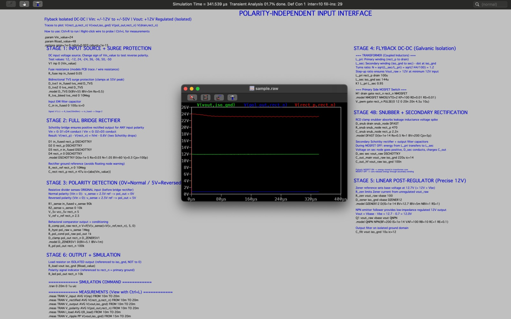

# Power Interface Simulation (Brownie Points Challenge)

This document provides a summary of the SPICE simulation developed for the hackathon's "Brownie Points" bonus challenge.

For the full theoretical breakdown, equations, and simulation waveforms, see the [Simulation Guide](../simulation/README.md).

---

## 1. Challenge Objectives

The goal was to design and simulate a front-end power interface capable of:
1. **Wide DC Input**: Accepting input voltages from $\pm 12\text{V}$ to $\pm 50\text{V}$.
2. **Polarity Independence**: Automatically providing rectified positive internal voltage regardless of whether input polarity is normal ($V_{\text{in}} > 0$) or reversed ($V_{\text{in}} < 0$).
3. **Galvanic Isolation**: Using a flyback transformer stage to provide galvanic isolation between the primary input and the regulated output.
4. **Regulated Output**: Providing a stable $+12.0\text{V}$ DC output.
5. **Polarity Telemetry**: Outputting a digital signal ($0\text{V} = \text{Normal Polarity}$, $5\text{V} = \text{Reversed Polarity}$) referenced to the primary domain.

---

## 2. Reconstructed SPICE Artifacts

> [!NOTE]
> **Source Notice**: The original hackathon repository contained the simulation output waveform and schematic notes as an image ([`simulation/assets/images/ltspice-flyback-output.jpeg`](../simulation/assets/images/ltspice-flyback-output.jpeg)). The standalone SPICE netlists ([`polarity_protection_flyback.cir`](../simulation/polarity_protection_flyback.cir) and [`polarity_protection_flyback.net`](../simulation/polarity_protection_flyback.net)) were reconstructed from the netlist text preserved in that artifact.

---

## 3. Circuit Stages

1. **Stage 1 — Input Protection**: $0.05\,\Omega$ series protection resistor, bidirectional $55\text{V}$ TVS clamp, and $100\,\mu\text{F}$ filter capacitor.
2. **Stage 2 — Schottky Full-Bridge Rectifier**: 4-diode Schottky bridge ensuring positive voltage on the internal rail.
3. **Stage 3 — Polarity Detection**: $90\text{k}\Omega / 10\text{k}\Omega$ voltage divider and comparator with $2.5\text{V}$ reference.
4. **Stage 4 — Flyback DC-DC Stage**: Coupled inductors ($100\,\mu\text{H} : 144\,\mu\text{H}$, $K=0.95$) with $100\text{kHz}$ NMOS switch and RCD snubber.
5. **Stage 5 — Linear Post-Regulator**: $12.7\text{V}$ Zener reference and NPN emitter follower for low-ripple $12.0\text{V}$ output.
6. **Stage 6 — Output Domain**: Isolated output filter capacitor and load resistor.
